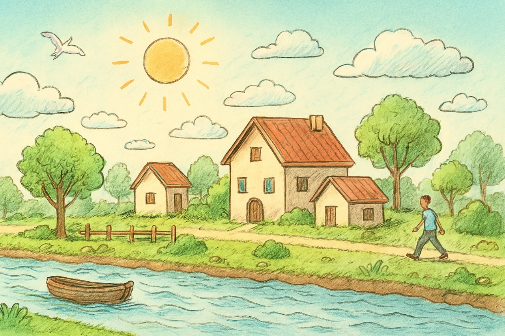

# 🌿 Village Scenario with Animation (OpenGL)

## 📌 Project Overview
**Village Scenario with Animation** is a 2D computer graphics project developed using **C++ and OpenGL (FreeGLUT)**.  
The project visually represents a peaceful rural village environment with **real-time animations**, showcasing natural and human activities such as flowing rivers, moving clouds, walking humans, flying birds, and swaying trees.

This project was developed as part of **CSE422: Computer Graphics Lab** at **Daffodil International University**.

---

## 👨‍💻 Team Members
- **Abdullah Al Noman** (ID: 221-15-5387)  
- **Nushrat Jahan Mila** (ID: 221-15-5758)  
- **Abrar Hameem Bornil** (ID: 221-15-5331)

**Supervisor:**  
*Kridita Ray*  
Lecturer, Department of CSE, DIU

---

## 🎯 Objectives
- Implement core **computer graphics algorithms** (Bresenham’s Line Drawing Algorithm)
- Apply **2D transformations** (translation, rotation, scaling)
- Build a complete animated village scene using OpenGL primitives
- Demonstrate **real-time animation** using timer functions
- Practice modular, structured, and clean C++ programming

---

## 🧩 Features
- 🌞 Moving sun with rotating rays  
- ☁️ Drifting clouds at variable speeds  
- 🌊 Flowing river with wave animation  
- 🚤 Floating boat on river  
- 🌳 Trees and grass swaying with wind  
- 🏠 Multiple houses (main & small houses)  
- 🚶 Walking human animation  
- 🐦 Flying bird with wing movement  
- 🪵 Fence and riverbank decorations  

---

## 🛠️ Technologies Used
- **C++**
- **OpenGL**
- **FreeGLUT / GLUT**
- **Visual Studio / Code::Blocks**
- **Trigonometric functions (sin, cos)**

---

## 🧠 Algorithms & Techniques
### Bresenham’s Line Drawing Algorithm
Used for:
- Fence outlines  
- Window frames  
- Door edges  
- Structural boundaries  

### 2D Transformations
- **Translation:** Sun, clouds, human, boat, bird  
- **Scaling:** Trees, houses, bushes  
- **Rotation:** Sun rays, natural sway effects  

### Animation Logic
- Timer-based animation (~60 FPS)
- Sine wave motion for natural effects
- Screen wrap-around for continuous motion

---

## 🏗️ System Architecture
The project is modularly designed where:
- Each object has its own drawing function
- Global animation variables control motion
- Objects are rendered in proper layering order

**Rendering Order:**
1. Sky  
2. Sun  
3. Clouds  
4. Bird  
5. Ground  
6. River  
7. Boat  
8. Trees  
9. Houses  
10. Fence  
11. Human  

---

## ✏️ Project Sketch
> Conceptual sketch of the village scene

---

## 📸 Project Screenshots

---

## ▶️ How to Run the Project
1. Install **OpenGL & FreeGLUT**
2. Open the project in **Visual Studio / Code::Blocks**
3. Link OpenGL and GLUT libraries
4. Compile and run the `.cpp` file
5. Enjoy the animated village scene 🎉

---

## ⚠️ Limitations
- Fully **2D scene** (no 3D depth)
- No texture mapping
- No user interaction (keyboard/mouse)
- Basic motion models (no physics engine)

---

## 🚀 Future Enhancements
- 🌙 Day–Night cycle
- 🎮 User interaction (keyboard/mouse)
- 🌧️ Weather effects (rain, fog)
- 🔊 Sound effects
- 🌍 Convert to 3D environment
- 🐄 Add animals and vehicles

---

## 🌱 Impact & Sustainability
- Educational visualization of nature
- Promotes clean, reusable, and lightweight code
- Suitable for low-end systems
- Encourages creativity in computer graphics

---

## 📚 References
1. OpenGL Programming Guide – Addison Wesley  
2. GeeksforGeeks OpenGL Tutorials  
3. Stack Overflow (Animation Logic Discussions)

---

## 📄 License
This project is developed for **academic and educational purposes only**.

---

⭐ *If you like this project, don’t forget to give it a star!* ⭐
